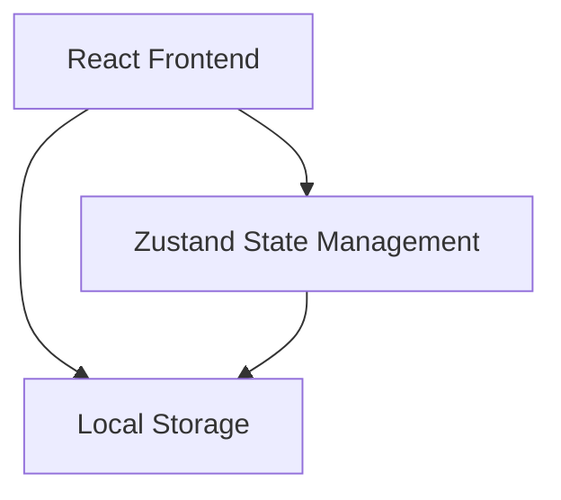
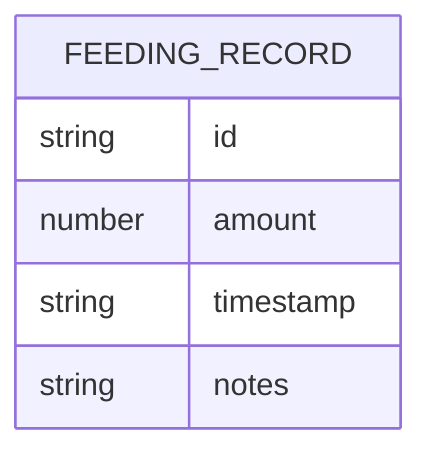

## 1. Architecture Design


## 2. Technology Description
- Frontend: React@18 + TypeScript + tailwindcss@3 + vite
- Initialization Tool: vite-init
- Backend: None（本地存储）
- Database: Local Storage（浏览器本地存储）

## 3. Route Definitions
| Route | Purpose |
|-------|---------|
| / | 首页，显示统计和最新记录 |
| /add | 添加新记录页面 |
| /history | 历史记录页面 |
| /stats | 统计页面 |

## 4. API Definitions
无需后端API，数据存储在Local Storage中

## 5. Server Architecture Diagram
无需后端

## 6. Data Model

### 6.1 Data Model Definition


### 6.2 Data Definition Language
无SQL表，使用Local Storage存储JSON数据

```typescript
// 数据类型定义
interface FeedingRecord {
  id: string;
  amount: number; // 喝奶量(ml)
  timestamp: string; // ISO时间字符串
  notes?: string; // 备注
}
```
