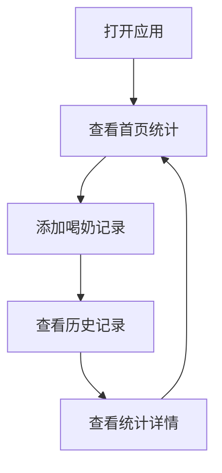

## 1. Product Overview
孩子喝奶记录应用，帮助家长记录孩子的喝奶时间和喝奶量，方便追踪孩子的饮食规律。
- 主要用途：记录、查看、统计孩子的喝奶数据
- 目标用户：婴儿家长、护理人员

## 2. Core Features

### 2.1 User Roles
| Role | Registration Method | Core Permissions |
|------|---------------------|------------------|
| Normal User | 无需注册 | 使用所有功能，数据存储在本地 |

### 2.2 Feature Module
1. **记录页面**：添加新的喝奶记录
2. **历史记录页面**：查看所有历史记录
3. **统计页面**：查看喝奶数据统计

### 2.3 Page Details
| Page Name | Module Name | Feature description |
|-----------|-------------|---------------------|
| 记录页面 | 添加记录表单 | 输入喝奶时间、喝奶量，保存记录 |
| 记录页面 | 快速添加按钮 | 提供常用喝奶量的快速选择 |
| 历史记录页面 | 记录列表 | 展示所有记录，支持删除操作 |
| 历史记录页面 | 记录卡片 | 显示时间、喝奶量，带删除功能 |
| 统计页面 | 数据统计 | 展示今日总喝奶量、平均喝奶量等 |
| 统计页面 | 图表展示 | 用图表直观展示喝奶趋势 |

## 3. Core Process
用户打开应用 → 查看今日统计 → 添加新的喝奶记录 → 查看历史记录 → 查看统计数据

## 4. User Interface Design
### 4.1 Design Style
- 主色调：柔和的粉色/蓝色渐变（适合婴儿产品）
- 按钮风格：圆角按钮，带有微阴影
- 字体：圆润可爱的无衬线字体
- 布局风格：卡片式布局，简洁清爽
- 图标风格：温馨可爱的图标

### 4.2 Page Design Overview
| Page Name | Module Name | UI Elements |
|-----------|-------------|-------------|
| 首页 | 统计卡片 | 渐变背景，大数字显示，柔和动画 |
| 首页 | 记录列表 | 时间轴样式，卡片布局 |
| 添加记录页 | 表单 | 大输入框，友好的提示文字 |
| 添加记录页 | 快速选择 | 按钮组，点击即可选择常用量 |

### 4.3 Responsiveness
- 移动端优先设计
- 触摸优化，大点击区域
- 适配各种屏幕尺寸

### 4.4 3D Scene Guidance
不适用
